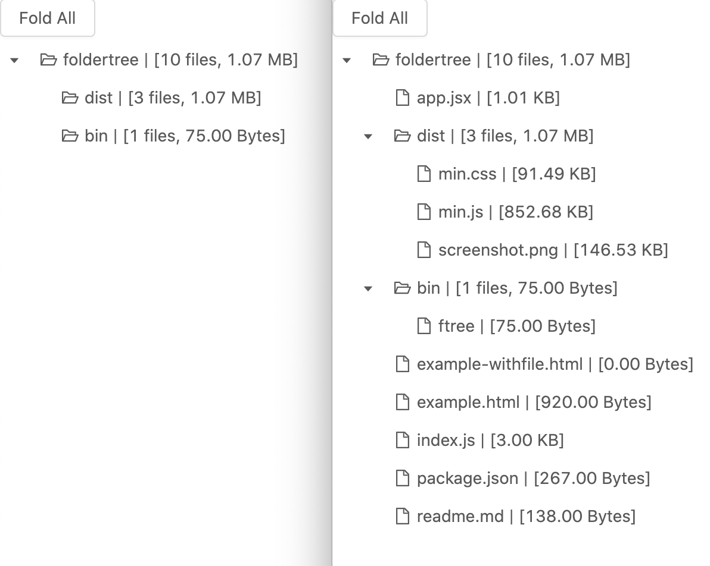

# Folder Tree

## features
- zero dependency (except the min.js/min.css of course)
- each folder has its own summary
- interactive (click folder to trigger expand/fold)

## screenshot


## usage
```bash
git clone https://github.com/iwestlin/foldertree && cd foldertree
npm link
```
It will add `ftree` to your `$PATH`, and can be used like:
```bash
ftree path-to-folder > tree.html
```
Then just open `tree.html` in browser.

If you don't want add it to path, then simply run commands like:
```bash
./bin/ftree . > example.html

./bin/ftree . -f > example-withfile.html # -f or --file, means show tree with files

./bin/ftree . -s > example-snap.html # -s or --snap, means export html in https://github.com/rlv-dan/Snap2HTML
```
